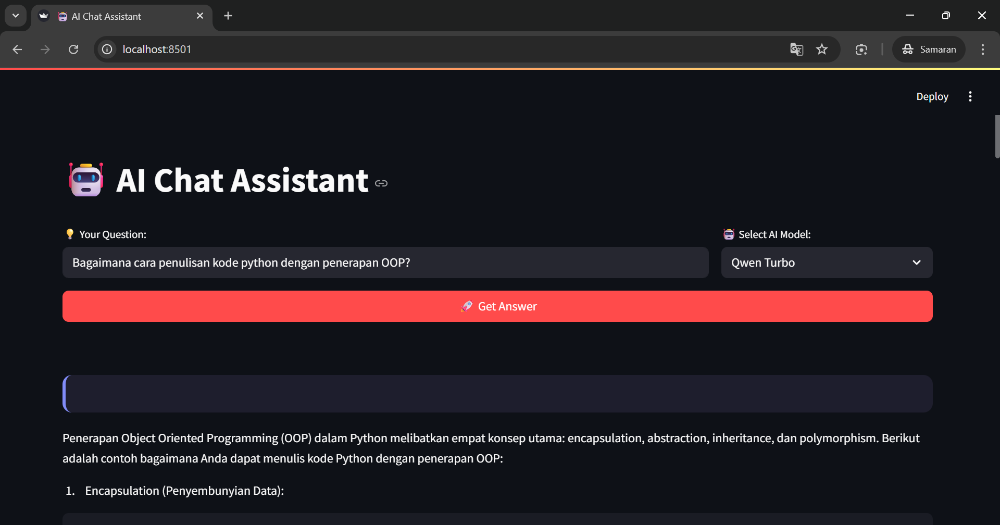

# AI-ML-Intro-AlibabaCloud

Proyek ini merupakan bagian dari kursus "Intro to AI & ML + Hands-on with Model Studio API" di Alibaba Cloud. Proyek ini mencakup implementasi API Qwen untuk membangun aplikasi AI sederhana.

## Fitur Utama

* Mendukung model seperti `qwen-turbo`, `qwen-plus`, dan `qwen-max`.
* Integrasi API Qwen menggunakan Python.
* Aplikasi web interaktif menggunakan Streamlit.

## Persyaratan

* Python 3.x
* Library Python: `dashscope`, `streamlit`

## Instalasi

1. Clone repositori ini:
   
   ```bash
   git clone https://github.com/RozhakDev/AI-ML-Intro-AlibabaCloud.git
   ```
2. Instal dependensi:
   
   ```bash
   pip install -r requirements.txt
   ```
3. Jalankan aplikasi:
   
   ```bash
   python -m streamlit run ai_app.py
   ```

## Tangkapan Layar



## Lisensi

Proyek ini dilisensikan di bawah [MIT License](LICENSE).